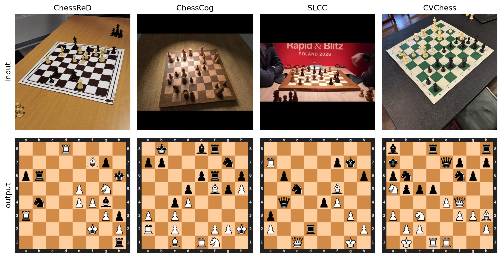

# ChessQueries

Chess board recognition: provide a photo of a real-life chessboard and receive
its chess position.

📄 [Paper](https://arxiv.org/abs/2608.30762) ·
📊 [Dataset](https://huggingface.co/datasets/joelseytre/slcc) ·
🤖 [Model weights](https://huggingface.co/joelseytre/chessqueries)



## Model

ChessQueries consists of a 304M-parameter ViT-L/14 encoder that maps a 644 × 644
input image to patch tokens. Sixty-four learned queries—one for each board
square—cross-attend to those tokens through a DETR-style decoder. A single
shared linear head maps each decoded query to its per-square class.

Best exact-board accuracy reported in the paper for a model trained on the
ChessReD, ChessCog, and SLCC training splits:

| ChessReD | ChessCog | SLCC | CVChess (zero-shot) |
|---:|---:|---:|---:|
| **99.5%** | **98.5%** | **87.1%** | **87.6%** |

## Quick start

ChessQueries requires Python 3.12 and [Poetry](https://python-poetry.org/).
Install the visualizer and launch the local Gradio demo:

```bash
poetry install --with viz
poetry run chessqueries-demo
```

You can also predict directly from one or more images:

```bash
poetry run chessqueries-predict photo.jpg --viz prediction.png
```

On first use, both commands download and verify the 1.49 GB
[safetensors checkpoint](https://huggingface.co/joelseytre/chessqueries), then
cache it under `checkpoints/release/`.

## Citation

```bibtex
@misc{seytre2026chessqueries,
  title         = {ChessQueries: Toward Better Chess Board Recognition},
  author        = {Seytre, Jo{\"e}l},
  year          = {2026},
  eprint        = {2608.30762},
  archivePrefix = {arXiv},
  primaryClass  = {cs.CV},
  doi           = {10.48550/arXiv.2608.30762},
  url           = {https://arxiv.org/abs/2608.30762}
}
```

## Licenses

- **Code** — [PolyForm Noncommercial 1.0.0](LICENSE), including the required
  notice: Copyright (c) 2026 the chessqueries authors.
- **Model weights** — [PolyForm Noncommercial 1.0.0](https://huggingface.co/joelseytre/chessqueries#license).
- **SLCC annotations** — [CC BY-NC 4.0](DATA_LICENSE). The source broadcasts
  and reconstructed frames are not distributed and remain the property of
  their respective rights holders.

Commercial use is not licensed.

## Going further

See [DEVELOPMENT.md](DEVELOPMENT.md) for repository layout, data preparation,
training and evaluation commands, experiment utilities, and checks.

See the [minimal reproduction guide](minimal_reproduction/README.md) for a
self-contained implementation of the model, training, evaluation, and leakage
checks used in the paper.
